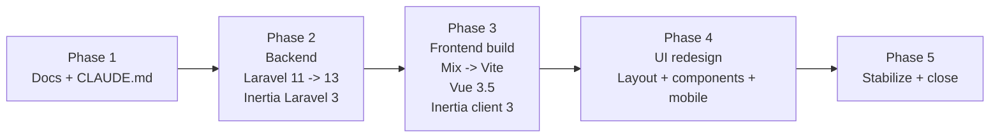

# UPGRADE_2026 — Major Platform Upgrade

Tracking document for the 2026 major upgrade of the Compenzations application.

- **Branch:** `major-upgrade`
- **Baseline tag/branch:** `backup-v1`
- **Start date:** 2026-04-19

---

## 1. Target Stack

| Layer | From | To |
| --- | --- | --- |
| PHP | `^8.2` | `^8.3` |
| Laravel | `v11.47.0` | `^13.0` |
| `inertiajs/inertia-laravel` | `v1.3.3` | `^3.0` |
| Laravel Sanctum | `^4.0` | `^4.0` (latest patch) |
| PHPUnit | `^11.0` | `^12.0` |
| Ziggy | `^2.0` | `^2.0` (latest) |
| Vue | `3.2.31` | `^3.5` |
| Inertia client | `@inertiajs/inertia 0.11` + `@inertiajs/inertia-vue3 0.6` + `@inertiajs/vue3 1.2` | `@inertiajs/vue3 ^3.0` only |
| Build tool | `laravel-mix ^6.0.6` | `vite ^7` + `@vitejs/plugin-vue ^6` + `laravel-vite-plugin ^2` |
| Vue datepicker / currency | `vue3-datepicker`, `vue-currency-input` | re-evaluate for Vue 3.5 / keep if compatible |

---

## 2. Phase Overview



---

## 3. Phase 1 — Documentation (zero risk)

**Status: IN PROGRESS**

Deliverables:

- [x] `CLAUDE.md` — project-wide agent guide.
- [ ] `UPGRADE_2026.md` — this document.
- [ ] Refresh `README.md` with the new stack, quickstart, and links.
- [ ] Refresh `docs/START_DEVELOPMENT.md` and `docs/README.md`.
- [ ] Archive `LARAVEL_11_UPGRADE.md` into `docs/archive/` (retains history but stops being the canonical doc).

No code, composer, npm or migration changes.

---

## 4. Phase 2 — Backend

**Status: not started**

### 4.1 `composer.json` changes

```jsonc
{
  "require": {
    "php": "^8.3",
    "doctrine/dbal": "^4.4",
    "guzzlehttp/guzzle": "^7.8",
    "inertiajs/inertia-laravel": "^3.0",
    "laravel/framework": "^13.0",
    "laravel/sail": "^1.26",
    "laravel/sanctum": "^4.0",
    "laravel/tinker": "^2.9",
    "mpdf/mpdf": "^8.2",
    "setasign/fpdi": "^2.1",
    "tightenco/ziggy": "^2.0"
  },
  "require-dev": {
    "fakerphp/faker": "^1.23",
    "laravel/breeze": "^2.0",
    "laravel/pint": "^1.16",
    "laravel/sail": "^1.26",
    "mockery/mockery": "^1.6",
    "nunomaduro/collision": "^8.0",
    "phpunit/phpunit": "^12.0"
  }
}
```

### 4.2 Known breaking changes / items to review

- **Laravel 12:** minimal breaking changes; mainly dependency bumps (Symfony 7, Carbon 3). Verify `Carbon::parse()` call sites still behave (we use `Carbon::parse($request->input('date_from'))->format('Y-m-d')` in exports).
- **Laravel 13:** PHP 8.3+ minimum. New attribute-based controller middleware. Review any custom middleware wiring inside `bootstrap/app.php`.
- **Inertia Laravel 3:**
  - Drops Laravel 10 and PHP 8.1.
  - Removes deprecated `LazyProp` and test concerns. Replace with `Inertia::defer(...)` / `Inertia::optional(...)` where applicable.
  - `HandleInertiaRequests` middleware signature may require small adjustments (share API).
  - New exception handling: `Inertia::handleExceptionsUsing()` can be wired in `bootstrap/app.php`.
  - Blade components `<x-inertia-head />` and `<x-inertia />` replace old `@inertiaHead` / `@inertia` directives — we'll pick one style in Phase 3.

### 4.3 Config & structure review

- [ ] `bootstrap/app.php` — confirm middleware/exception/routes registration still holds (Laravel 11 shape is largely compatible with 13).
- [ ] `config/auth.php` — already migrated to `password_reset_tokens` (per `LARAVEL_11_UPGRADE.md`).
- [ ] `config/app.php` — drop `RouteServiceProvider` (already done), verify `providers[]` list.
- [ ] `app/Http/Middleware/HandleInertiaRequests.php` — verify `share()` structure against Inertia v3.
- [ ] `app/Http/Middleware/TrustProxies.php` — confirm `proxies()` still matches L13 signature.
- [ ] Replace `LazyProp` usages if any (search `Inertia::lazy(`).

### 4.4 User commands

After the agent applies file edits:

```bash
cd /home/greentech/www/compenzations

composer update
php artisan optimize:clear
php artisan migrate           # no destructive changes expected
php artisan test              # full suite
```

If composer fails on PHP version, install PHP 8.3 in WSL first:

```bash
sudo add-apt-repository ppa:ondrej/php -y
sudo apt update
sudo apt install -y php8.3 php8.3-cli php8.3-mbstring php8.3-xml php8.3-mysql php8.3-gd php8.3-curl php8.3-bcmath php8.3-zip
```

Then make it default: `sudo update-alternatives --config php`.

---

## 5. Phase 3 — Frontend Build + Client

**Status: not started**

### 5.1 `package.json` changes

```jsonc
{
  "private": true,
  "type": "module",
  "scripts": {
    "dev": "vite",
    "build": "vite build"
  },
  "devDependencies": {
    "@headlessui/vue": "^1.7",
    "@heroicons/vue": "^2.0",
    "@tailwindcss/forms": "^0.5",
    "@vitejs/plugin-vue": "^6.0",
    "autoprefixer": "^10.4",
    "axios": "^1.7",
    "date-fns": "^3.0",
    "laravel-vite-plugin": "^2.0",
    "postcss": "^8.4",
    "postcss-import": "^16.0",
    "tailwindcss": "^3.4",
    "vite": "^7.0",
    "vue": "^3.5"
  },
  "dependencies": {
    "@inertiajs/vue3": "^3.0",
    "mitt": "^3.0",
    "slugify": "^1.6",
    "vue-i18n": "^10.0"
  }
}
```

Remove:
- `laravel-mix`
- `@inertiajs/inertia`
- `@inertiajs/inertia-vue3`
- `@inertiajs/progress` (Inertia v3 has built-in progress indicator)
- `@vue/compiler-sfc` (Vite bundles it)
- `vue-loader` (Webpack-only)
- `faker` (dev-only placeholder usage)
- `vue3-datepicker` — validate need first; prefer native `<input type="date">` or Headless UI combobox
- `vue-currency-input` — validate need; we mostly format on display

### 5.2 New `vite.config.js`

```js
import { defineConfig } from 'vite'
import laravel from 'laravel-vite-plugin'
import vue from '@vitejs/plugin-vue'
import path from 'node:path'

export default defineConfig({
    plugins: [
        laravel({
            input: ['resources/js/app.js', 'resources/css/app.css'],
            refresh: true,
        }),
        vue({
            template: { transformAssetUrls: { base: null, includeAbsolute: false } },
        }),
    ],
    resolve: {
        alias: {
            '@': path.resolve(__dirname, 'resources/js'),
        },
    },
})
```

### 5.3 `resources/js/app.js` rewrite

```js
import './bootstrap'
import '../css/app.css'

import { createApp, h } from 'vue'
import { createInertiaApp } from '@inertiajs/vue3'
import { resolvePageComponent } from 'laravel-vite-plugin/inertia-helpers'
import { createI18n } from 'vue-i18n'
import { ZiggyVue } from 'ziggy-js'
import { get as getLocale } from './services/locale'

const appName = document.title || 'Compenzations'

createInertiaApp({
    title: (title) => `${title} - ${appName}`,
    resolve: (name) => resolvePageComponent(`./Pages/${name}.vue`, import.meta.glob('./Pages/**/*.vue')),
    async setup({ el, App, props, plugin }) {
        const data = await getLocale()
        localStorage.setItem('locale', data.locale)
        const i18n = createI18n({ legacy: false, ...data })

        createApp({ render: () => h(App, props) })
            .use(plugin)
            .use(i18n)
            .use(ZiggyVue)
            .mount(el)
    },
    progress: { color: '#4B5563' },
})
```

### 5.4 `resources/views/app.blade.php` changes

- Replace Mix/asset directives with `@vite(['resources/css/app.css', 'resources/js/app.js'])`.
- Keep `<meta name="csrf-token" content="{{ csrf_token() }}">`.
- Use `@inertiaHead` and `@inertia` (Laravel Inertia v3 still supports them; Blade components are optional).

### 5.5 Global import refactor

Search & migrate across `resources/js/**`:

| Old import | New import |
| --- | --- |
| `from '@inertiajs/inertia'` (e.g. `Inertia`) | `import { router } from '@inertiajs/vue3'` and use `router.get/post/visit(...)` |
| `from '@inertiajs/inertia-vue3'` (`Head`, `Link`, `useForm`, `usePage`) | `from '@inertiajs/vue3'` |
| `from '@inertiajs/progress'` | remove; configured via `createInertiaApp({ progress })` |
| `this.$inertia.get(route(...))` | `router.get(route(...))` (composition API) or keep `$inertia` only if mixin is re-added — prefer explicit `router` |

Known locations to touch:

- `resources/js/app.js` (already handled by rewrite).
- `resources/js/Pages/**/*.vue` (Head, Link imports).
- `resources/js/Components/**/*.vue` (Link, useForm).
- `resources/js/mixins/currentRoute.js` — switch `Inertia` to `router` from `@inertiajs/vue3`.

### 5.6 User commands

```bash
rm -rf node_modules package-lock.json
npm install
npm run dev
# In another terminal:
php artisan serve
```

---

## 6. Phase 4 — UI Redesign

**Status: not started**

### 6.1 Design tokens (`tailwind.config.js`)

- Define semantic colors: `primary` (currently blue), `accent` (orange), `surface`, `surface-muted`, `ink` (text), `ink-muted`, `danger`, `success`, `warning`.
- Keep `stone-*` for neutral surfaces.
- Add `fontFamily.sans` with Inter / system stack.
- Add `boxShadow.card`, `boxShadow.elevated`.
- Add consistent `spacing` extensions only if absolutely needed — prefer default scale.

### 6.2 New shell layout

- **Sidebar:** collapsible (full / icons only), sticky, mobile drawer triggered by a hamburger.
- **Top bar:** breadcrumb (already existing data), global search (future), user menu, locale switcher.
- **Main area:** max-width container with responsive padding.

### 6.3 Component library

Reusable atoms/molecules in `resources/js/Components/`:

| Component | Variants / props |
| --- | --- |
| `Button.vue` | `variant: primary \| secondary \| ghost \| danger`, `size: sm \| md \| lg`, `iconLeft`, `iconRight`, `loading`. |
| `Input.vue` | types (`text`, `date`, `number`), `error`, `hint`, `iconLeft`. |
| `Select.vue` / `Combobox.vue` | Headless UI based; async search support. |
| `Card.vue` | `title`, `actions` slot, `footer` slot. |
| `Modal.vue` | full-screen on mobile, centered on desktop; closable. |
| `Table.vue` | sticky header, responsive, empty state, per-row click handler. |
| `Badge.vue` | tone: `neutral \| info \| success \| warning \| danger`. |
| `Pagination.vue` | keep current but restyle. |
| `EmptyState.vue` | icon + title + description + optional CTA. |
| `Toast.vue` | keep; restyle. |
| `Breadcrumb.vue` | lifted out of `AdminLayout` for reuse. |

### 6.4 Dashboard

`resources/js/Pages/Dashboard.vue` gets:

- 4 KPI cards: total Kompenzacije, completed this month, total Računi, number of Entities.
- Recent Kompenzacije list (last 5).
- Recent Računi list (last 5).
- Quick actions: "Dodaj kompenzacijo", "Dodaj stranko", "Izvozi".

### 6.5 Page refactor checklist

- [ ] `Dashboard.vue` with widgets.
- [ ] `Entities.vue` / `Entity.vue` — new table, new detail card layout.
- [ ] `Compenzations.vue` — keep current simplification; restyle search + button on new tokens.
- [ ] `Compenzation.vue` / `AddCompenzation.vue` — multi-step with new component set.
- [ ] `Bills.vue` — new table.
- [ ] `Exports/Index.vue` — card grid restyle.
- [ ] `Exports/Bills.vue`, `Exports/Contracts.vue`, `Exports/Compenzations.vue` — consistent date-range form.
- [ ] `CompenzationStats.vue` — new KPI header and restyled table.
- [ ] Auth pages (Login / Register / Reset / Forgot) — refreshed to match.

### 6.6 Mobile pass

- Sidebar becomes a drawer under `md`.
- Tables: horizontal scroll wrapper.
- Modals: full-screen under `sm`.
- Hit targets ≥ 44 px.

---

## 7. Phase 5 — Stabilize & Close

- [ ] All feature tests pass (`php artisan test`).
- [ ] Manual QA checklist (auth, add/edit entity, add/edit compenzation, PDF generation, XML export for each export type, statistics).
- [ ] Final commit on `major-upgrade`, open PR, run CI (if any), merge to `main`.
- [ ] Tag release `v2.0.0`.
- [ ] Update `CLAUDE.md` "Currently installed" table to match post-upgrade reality; mark `UPGRADE_2026.md` as historical.

---

## 8. Rollback Plan

If a phase breaks the app beyond quick fix:

```bash
git checkout main
git reset --hard backup-v1   # or git checkout backup-v1
```

Or undo Phase 3 only:

```bash
git checkout major-upgrade
git revert <phase-3-commits>
```

No destructive DB changes are planned in Phases 1–4. Only stop a phase if a migration has actually run and would require DB rollback; otherwise code rollback is sufficient.
